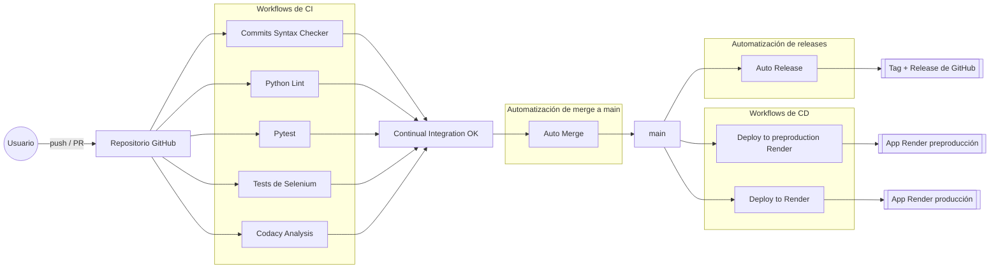

# Workflows

#### Versión 1.0 del documento

|                |                                         |
| -------------- | --------------------------------------- |
| **Asignatura** | Evolución y Gestión de la Configuración |
| **Curso**      | 2025/2026                               |
| **Proyecto**   | steamgames-hub-2                        |

| **Integrantes**               | **Correo**            |
| ----------------------------- | --------------------- |
| Julia Virginia Ángeles Burgos | julangbur@alum.us.es  |
| Manuel Jesús Benito Merchán   | manbenmer1@alum.us.es |
| Francisco Fernández Noguerol  | frafernog@alum.us.es  |
| Beatriz Gutiérrez Arazo       | beagutara@alum.us.es  |
| José Javier Morán Corbacho    | josmorcor3@alum.us.es |
| Alba Ramos Vargas             | albramvar1@alum.us.es |

## Introducción

Este documento describe los workflows de GitHub Actions utilizados en el proyecto, detallando su finalidad, las tareas que automatizan y las condiciones bajo las que se ejecutan.

Los workflows se agrupan en dos bloques principales:

1. **Workflows de Integración Continua (CI).** Validan el código, ejecutan tests, revisan estilo y analizan calidad.

2. **Workflows de Despliegue Continuo (CD).** Ejecutan tests y, si todo es correcto, despliegan automáticamente la aplicación en preproducción o producción.

El objetivo es ofrecer una visión clara y estructurada del pipeline de automatización del proyecto.

## Índice

- [Introducción](#introducción)
- [Índice](#índice)
- [Diagrama de flujo CI/CD](#diagrama-de-flujo-cicd)
- [Workflows de Integración Continua (CI)](#workflows-de-integración-continua-ci)
  - [Auto Release](#auto-release-ci_auto_releaseyml)
  - [Commits Syntax Checker](#commits-syntax-checker-ci_commitsyml)
  - [Python Lint](#python-lint-ci_lintyml)
  - [Pytest](#pytest-ci_pytestyml)
  - [Selenium tests](#selenium-ci_seleniumyml)
  - [Codacy Analysis](#codacy-analysis-codacy-analysisyml)
- [Workflows de Despliegue Continuo (CD)](#workflows-de-despliegue-continuo-cd)
  - [Deploy to preproduction Render](#deploy-to-preproduction-render-render-preproductionyml)
  - [Deploy to Render](#deploy-to-render-renderyml)
- [Notas finales](#notas-finales)

## Diagrama de flujo CI/CD

## Workflows de Integración Continua (CI)

### Auto Release ([CI_auto_release.yml](https://github.com/steamgames-hub/steamgames-hub-2/blob/main/.github/workflows/CI_auto_release.yml))

Genera automáticamente un nuevo tag y una Release de GitHub cada vez que se actualiza la rama main.

#### Acciones principales del workflow

1. Descarga el repositorio.
2. Calcula la siguiente versión según los tags existentes.
3. Crea un nuevo tag.
4. Muestra la versión generada en los logs.
5. Publica la Release asociada.

#### ¿Cuándo se ejecuta?

**> push**

Cuando se hace push a la rama main.

### Python Lint ([CI_lint.yml](https://github.com/steamgames-hub/steamgames-hub-2/blob/main/.github/workflows/CI_lint.yml))

Verifica estilo y formato del código Python usando flake8, black e isort.

#### Acciones principales del workflow

1. Configura Python 3.12.
2. Instala herramientas de linting y formateo.
3. Ejecuta flake8, black (--check) e isort (--check-only).
4. Permite continuar la ejecución para mostrar todos los errores.

#### ¿Cuándo se ejecuta?

**> push**

Cuando se hace un push a cualquier rama.

**> pull request**

Cuando se abre, se actualiza o se sincroniza con cambios nuevos.

### Pytest ([CI_pytest.yml](https://github.com/steamgames-hub/steamgames-hub-2/blob/main/.github/workflows/CI_pytest.yml))

Ejecuta la suite de tests del proyecto levantando un contenedor de MariaDB para pruebas.

#### Acciones principales del workflow

1. Configura variables de entorno para testing.
2. Levanta MariaDB 12.0.2 y comprueba su disponibilidad.
3. Instala dependencias del proyecto.
4. Ejecuta tests con pytest (excepto Selenium).
5. Garantiza pruebas de integración consistentes.

#### ¿Cuándo se ejecuta?

**> push, pull_request**

Cuando se hace push a cualquier rama o se abre pull request.

### Selenium tests ([CI_selenium.yml](https://github.com/steamgames-hub/steamgames-hub-2/blob/main/.github/workflows/CI_selenium.yml))

Ejecuta la suite de tests del proyecto levantando un contenedor de MariaDB para pruebas.

#### Acciones principales del workflow

1. Configura variables de entorno para testing.
2. Instala dependencias del proyecto.
3. Levanta la base de datos y la aplicación.
4. Comprueba que se haya inicializado bien.
5. Espera a que Selenium esté listo.
6. Ejecuta los tests de interfaz del repositorio.
7. Detiene la aplicación.

#### ¿Cuándo se ejecuta?

**> push, pull_request**

Cuando se hace push a cualquier rama o se abre pull request.

### Codacy Analysis ([CI_codacy_analysis.yml](https://github.com/steamgames-hub/steamgames-hub-2/blob/main/.github/workflows/CI_codacy_analysis.yml))

Ejecuta el análisis de calidad mediante la CLI oficial de Codacy y sube los resultados.

#### Acciones principales del workflow

1. Configura entorno de testing.
2. Descarga el repositorio.
3. Ejecuta análisis con codacy-analysis-cli.
4. Sube los resultados usando CODACY_PROJECT_TOKEN.

#### ¿Cuándo se ejecuta?

**> push**

Cuando se hace push a las ramas main, Trunk o bugfix.

**> pull request**

Cuando se abre o actualiza una pull request dirigida a main, Trunk o bugfix.

### Merge automático de trunk a main ([CI_merge_trunk_to_main](https://github.com/steamgames-hub/steamgames-hub-2/blob/main/.github/workflows/CI_merge_trunk_to_main.yml))

Hace periódicamente un merge de main a trunk.

#### Acciones principales del workflow

1. Descarga el repositorio.
2. Establece el bot auxiliar.
3. Hace merge de trunk a main.

#### ¿Cuándo se ejecuta?

Automáticamente los domingos a las 00:00.

## Workflows de Despliegue Continuo (CD)

### Deploy to preproduction Render ([CD_render_preproduction.yml](https://github.com/steamgames-hub/steamgames-hub-2/blob/main/.github/workflows/CD_render_preproduction.yml))

Ejecuta tests y despliega automáticamente en el entorno de preproducción de Render cuando estos finalizan correctamente.

#### Acciones principales del workflow

1. Define dos jobs: testing y deploy.
2. Pruebas: levanta MySQL, instala dependencias y ejecuta pytest.
3. Despliegue: envía una petición al deploy hook de Render.

#### ¿Cuándo se ejecuta?

**> push**

Cuando se hace push a las ramas main, Trunk o bugfix.

**> pull request**

Cuando se abre o actualiza una pull request dirigida a main, Trunk o bugfix.

### Deploy to Render ([CD_render_production.yml](https://github.com/steamgames-hub/steamgames-hub-2/blob/main/.github/workflows/CD_render_production.yml))

Realiza el despliegue automático en producción tras pasar los tests. Solo afecta a la rama principal.

#### Acciones principales del workflow

1. Ejecuta tests con las mismas condiciones que preproducción.
2. Envía el despliegue mediante el deploy hook de Render.

#### ¿Cuándo se ejecuta?

**> push**

Cuando se hace push a la rama main.

### Publish image in Dockerhub ([render.yml](https://github.com/steamgames-hub/steamgames-hub-2/blob/main/.github/workflows/CD_dockerhub.yml))

Sube la imagen del proyecto a Dockerhub.

#### Acciones principales del workflow

1. Se descarga el repositorio.
2. Se registra en Dockerhub.
3. Construye y publica la imagen.

#### ¿Cuándo se ejecuta?

**> release**

Cuando se hace release y esté está publicado.

## Notas finales

Los workflows descritos en este documento representan el estado actual del pipeline de automatización del proyecto.
Si en algún momento es necesario ajustar su comportamiento, añadir nuevas validaciones o modificar los despliegues, cualquier miembro del equipo puede solicitarlo creando una [issue](https://github.com/steamgames-hub/steamgames-hub-2/issues/new?template=feature.md) en el repositorio. Esto permite discutir los cambios, revisarlos de forma conjunta y mantener un sistema coherente y fácil de mantener.

El pipeline puede evolucionar con el tiempo, pero la estructura presentada aquí marca una base sólida sobre la que continuar trabajando.
